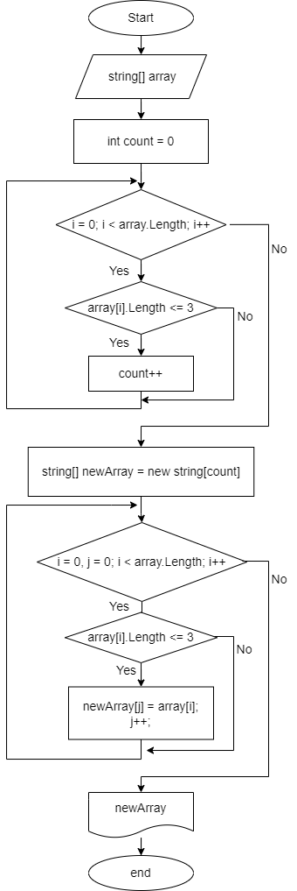

# Итоговая проверочная работа. #
## Задача алгоритмически не самая сложная, однако для полноценного выполнения проверочной работы необходимо: ##
>* Создать репозиторий на GitHub.
>* Нарисовать блок-схему алгоритма (можно обойтись блок-схемой основной содержательной части, если вы выделяете её в отдельный метод).
>* Снабдить репозиторий оформленным текстовым описанием решения (файл README.md).
>* Написать программу, решающую поставленную задачу.
>* Использовать контроль версий в работе над этим небольшим проектом (не должно быть так, что всё залито одним коммитом, как минимум этапы 2, 3, и 4 должны быть расположены в разных коммитах).
### ***Задача:*** ### 
>Написать программу, которая из имеющегося массива строк формирует новый массив из строк, длина которых меньше, либо равна 3 символам. Первоначальный массив можно ввести с клавиатуры, либо задать на старте выполнения алгоритма. При решении не рекомендуется пользоваться коллекциями, лучше обойтись исключительно массивами.
### ***Примеры:*** ###
>1. [“Hello”, “2”, “world”, “:-)”] → [“2”, “:-)”]
>2. [“1234”, “1567”, “-2”, “computer science”] → [“-2”]
>3. [“Russia”, “Denmark”, “Kazan”] → []
____

# Решение #
## 1. Создан репозиторий [ControlWorkBaevKirill](https://github.com/Kirrr-ill/ControlWorkBaevKirill.git).  
>git init  
git add README.md  
git commit -m "first commit"   
git remote add origin https://github.com/Kirrr-ill/ControlWorkBaevKirill.git  
>git push -u origin master
## 2. Нарисована блок схема решения алгоритма. ## 

